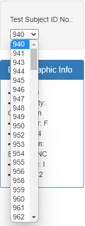
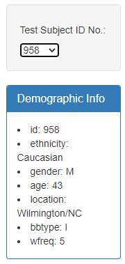
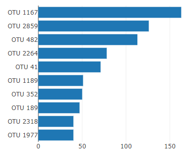
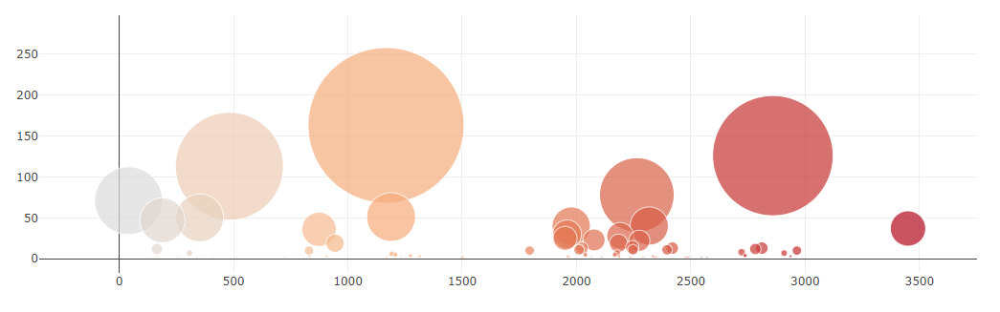

# Belly Button Biodiversity Visualization

## Introduction

As part of my GWU Data Analysis & Visualizations Boot Camp, I was tasked with creating an interactive dashboard to visualize belly button biodiversity data.

Technologies used in this project include:
* JavaScript
* Plotly.js
* D3.js
* HTML

## Screenshots

  

  

  

  

## References
Hulcr, J. et al. (2012) A Jungle in There: Bacteria in Belly Buttons are Highly Diverse, but Predictable. Retrieved from: http://robdunnlab.com/projects/belly-button-biodiversity/results-and-data/